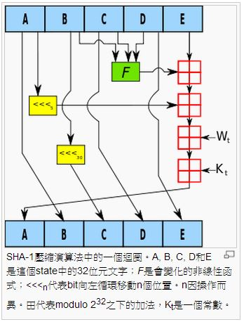
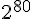
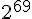
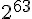
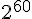

## 金融短訊：SHA 安全雜湊算法

由於上文介紹「比特幣」時發現「安全雜湊算法家族 SHA」 是該系統的一個關鍵演算法，目前的比特幣採用 SHA-2 (SHA-224、SHA-256、SHA-384，和SHA-512 的統稱, 比特幣應該是採用 SHA-256) 的演算法，因此我們將在此介紹有關 SHA 算法家族的原理，以便能進一步理解「比特幣」的運作原理。

### 簡介

安全雜湊演算法（英語：Secure Hash Algorithm）是一種能計算出一個數位訊息所對應到的，長度固定的字串（又稱訊息摘要）的演算法。且若輸入的訊息不同，它們對應到不同字串的機率很高；而SHA是FIPS所認證的五種安全雜湊演算法。這些演算法之所以稱作「安全」是基於以下兩點（根據官方標準的描述）：「1)由訊息摘要反推原輸入訊息，從計算理論上來說是很困難的。2)想要找到兩組不同的訊息對應到相同的訊息摘要，從計算理論上來說也是很困難的。任何對輸入訊息的變動，都有很高的機率導致其產生的訊息摘要迥異。」

SHA家族的五個演算法，分別是SHA-1、SHA-224、SHA-256、SHA-384，和SHA-512，由美國國家安全域（NSA）所設計，並由美國國家標準與技術研究院（NIST）發佈；是美國的政府標準。後四者有時並稱為SHA-2。SHA-1在許多安全協定中廣為使用，包括TLS和SSL、PGP、SSH、S/MIME和IPsec，曾被視為是MD5（更早之前被廣為使用的雜湊函式）的後繼者。但SHA-1的安全性如今被密碼學家嚴重質疑；雖然至今尚未出現對SHA-2有效的攻擊，它的演算法跟SHA-1基本上仍然相似；因此有些人開始發展其他替代的雜湊演算法。緣於最近對SHA-1的種種攻擊發表，「美國國家標準與技術研究院（NIST）開始設法經由公開競爭管道（類似高級加密標準AES的發展經過），發展一個或多個新的雜湊演算法。」

2012年10月2號，Keccak被選為NIST雜湊函式競賽的勝利者,成為SHA-3。 SHA-3並不是要取代SHA-2，因為SHA-2目前並沒有出現明顯的弱點。由於對MD5出現成功的破解，以及對SHA-0和SHA-1出現理論上破解的方法，NIST感覺需要一個與之前演算法不同的，可替換的加密雜湊演算法，也就是現在的SHA-3。設計者宣稱在Intel Core 2的CPU上面，此演算法的效能是12.5cpb（每位元組周期數，cycles per byte）。不過，在硬體實做上面，這個演算法比起其他演算法明顯的快上很多。

SHA-0 和 SHA-1可將一個最大 2 的 64 次方位元的訊息，轉換成一串160位元的訊息摘要；其設計原理相似於MIT教授Ronald L. Rivest所設計的密碼學雜湊演算法 MD4 和 MD5。

安全雜湊算法 SHA 家族的「輸入、輸出、迴圈次數、與目前的安全性」等特性，可參考以下列表。


### SHA-1 的演算法

以下是 SHA-1 演算法其中一個步驟的示意圖：



完整的 SHA-1 演算法如下所示：

```CPP
// Note: All variables are unsigned 32 bits and wrap modulo 2^32 when calculating
// 注意：所有變數都是 32 位元的無號整數，而且計算時都會對 2^32 取餘數。

// Initialize variables: 初始化下列變數
h0 := 0x67452301
h1 := 0xEFCDAB89
h2 := 0x98BADCFE
h3 := 0x10325476
h4 := 0xC3D2E1F0

// Pre-processing: 前處理階段
append the bit '1' to the message (對訊息補上一個 1)
append k bits '0', where k is the minimum number >= 0 such that the resulting message
    length (in bits) is congruent to 448(mod 512)  (若訊息長度未達 448 mod 512，則補一堆 0)
append length of message (before pre-processing), in bits, as 64-bit big-endian integer (

// Process the message in successive 512-bit chunks:
break message into 512-bit chunks
for each chunk
    break chunk into sixteen 32-bit big-endian words w[i], 0 ≤ i ≤ 15

//  Extend the sixteen 32-bit words into eighty 32-bit words:
    for i from 16 to 79
        w[i] := (w[i-3] xor w[i-8] xor w[i-14] xor w[i-16]) leftrotate 1
	
//  Initialize hash value for this chunk:
    a := h0
    b := h1
    c := h2
    d := h3
    e := h4
    
//  Main loop:
    for i from 0 to 79
        if 0 ≤ i ≤ 19 then
            f := (b and c) or ((not b) and d)
            k := 0x5A827999
        else if 20 ≤ i ≤ 39
            f := b xor c xor d
            k := 0x6ED9EBA1
        else if 40 ≤ i ≤ 59
            f := (b and c) or (b and d) or(c and d)
            k := 0x8F1BBCDC
        else if 60 ≤ i ≤ 79
            f := b xor c xor d
            k := 0xCA62C1D6
        temp := (a leftrotate 5) + f + e + k + w[i]
        e := d
        d := c
        c := b leftrotate 30
        b := a
        a := temp

//  Add this chunk's hash to result so far:
    h0 := h0 + a
    h1 := h1 + b
    h2 := h2 + c
    h3 := h3 + d
    h4 := h4 + e
    
// Produce the final hash value (big-endian):
digest = hash = h0 append h1 append h2 append h3 append h4
```

### SHA-1 的編碼範例

以下幾個範例顯示了 SHA-1 的用法：

範例一：SHA-1 的編碼範例

```
SHA1("The quick brown fox jumps over the lazy dog")
16進位：2fd4e1c6 7a2d28fc ed849ee1 bb76e739 1b93eb12
Base64：L9ThxnotKPzthJ7hu3bnORuT6xI=
```

範例二：範例一中的 dog 改為 cog 之後，SHA-1 的編碼結果就完全不同了。(而這也正式難以破解的原因，無跡可尋啊!)

```
SHA1("The quick brown fox jumps over the lazy cog")
16進位：de9f2c7f d25e1b3a fad3e85a 0bd17d9b 100db4b3
Base64：3p8sf9JeGzr60+haC9F9mxANtLM=
```

範例三：空字串的 SHA-1 編碼結果

```
SHA1("")
16進位：da39a3ee 5e6b4b0d 3255bfef 95601890 afd80709
Base64：2jmj7l5rSw0yVb/vlWAYkK/YBwk=
```

如果您對「如何用 SHA-1 實作雜湊現金技術」有興趣，可以參考筆者的另一篇文章，連結如下：

* [比特幣挖礦的背後 -- SHA 與雜湊現金](http://www.codedata.com.tw/social-coding/hashcash/)


### 結語

雖然 SHA-1 已經在各種資訊安全協定中廣被採用，但還是有些弱點，這也是為何要開發 SHA-2 與 SHA-3 的原因。

2005年，Rijmen 和 Oswald 發表了對 SHA-1 較弱版本（53次的加密迴圈而非80次）的攻擊：在    的計算複雜度之內找到碰撞。

2005年二月，王小雲、殷益群及於紅波發表了對完整版SHA-1的攻擊，只需少於    的計算複雜度，就能找到一組碰撞。

2005年8月17日的 CRYPTO 會議尾聲中王小雲、姚期智、姚儲楓再度發表更有效率的SHA-1攻擊法，能在    個計算複雜度內找到碰撞。

2006年的 CRYPTO 會議上，Christian Rechberger和Christophe DeCannière 宣布他們能在容許攻擊者決定部分原訊息的條件之下，找到SHA-1的一個碰撞。

不過這些攻擊法其實還是需要    以上的複雜度，而比特幣所採用的 SHA-2 到目前為止還沒有被較快速破解成功的案例，
但是還是有人認為 SHA-2 其實並不夠安全，像是以下文章就有這方面的質疑。

* [比特幣安全基礎毀滅？ SHA-2驚現重大安全疑團](http://www.bitecoin.com/online/2013/09/2398.html)

隨著技術進步，加密法似乎總是必須更新以防止破解的，不過類似比特幣這樣的系統，是相當有啟發性且創新的一種做法，
資訊領域的技術進入金融世界之後，或許還能摩擦出更多的火花也說不定。

### 參考文獻
* 維基百科：[SHA家族](http://zh.wikipedia.org/wiki/SHA%E5%AE%B6%E6%97%8F)
* Wikipedia:[SHA-1](http://en.wikipedia.org/wiki/SHA-1)
* [rfc3174: US Secure Hash Algorithm 1 (SHA1)](http://www.ietf.org/rfc/rfc3174.txt)
* [資訊與網路安全技術 ](http://www.mis.csu.edu.tw/tsnien/teach_manu/f8745/f8745_html/)
* [5-8 SHA-1 (Secure Hash Algorithm) 演算法](http://www.mis.csu.edu.tw/tsnien/teach_manu/f8745/f8745_html/chap5/chap5-8.htm)
* [5-6 MD5 壓縮函數](http://www.mis.csu.edu.tw/tsnien/teach_manu/f8745/f8745_html/chap5/chap5-6.htm)

【本文由陳鍾誠取材並修改自 [維基百科]，採用創作共用的 [姓名標示、相同方式分享] 授權】
