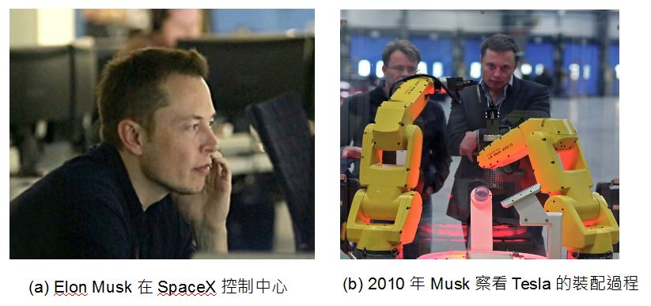
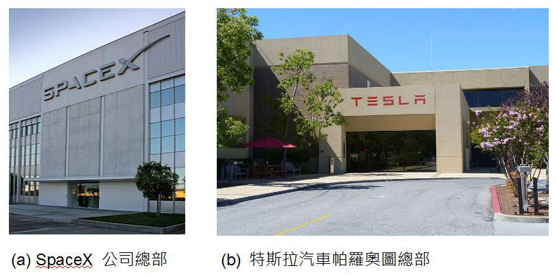
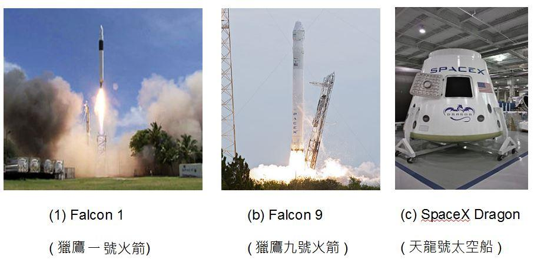
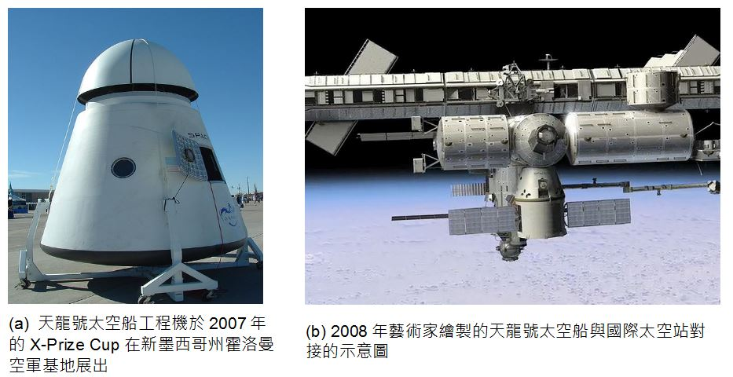
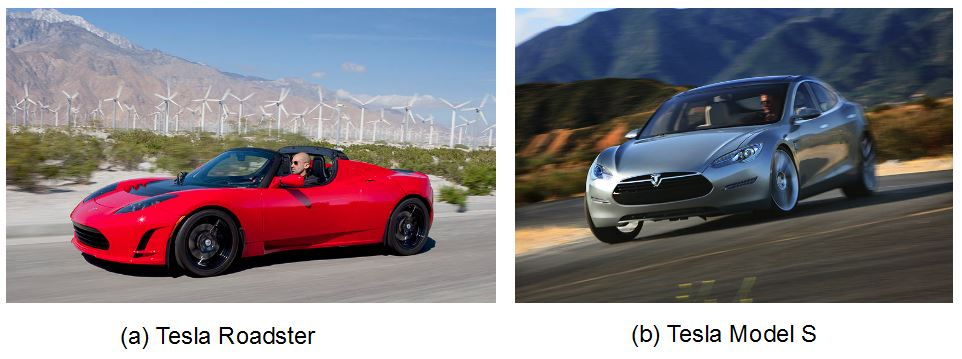

## 創業鋼鐵人 - Elon Musk

如果說「賈伯斯」完成了所有科技人的夢想，那麼「伊隆·馬斯克」的夢想，應該連賈伯斯本人都難以想像。

### 成長背景

伊隆·馬斯克（Elon Musk，1971年6月28日－） 的母親是加拿大人，而父親則是南非人，他出生於南非、高中畢業後到加拿大上大學、並在美國連續創辦了 PayPal, SpaceX 
與 Tesla 等公司 (下圖是 SpaceX 與 Tesla 公司的照片)。

鋼鐵人的導演 Jon Favreau 曾經說他受到 Elon Musk 的啟發進而塑造出主角 Tony Stark (東尼、史塔克) 的性格，因此後來 Elon Musk 就被戲稱為「創業鋼鐵人」。

Elon Musk 在 10 歲那年買了第一台電腦，並且自學了程式設計。12歲時就以 500 美元的價格出售了自己的第一個太空遊戲軟體 Blastar。

17歲時（1988年） Elon Musk 從南非 Pretoria Boys High School 畢業後，為了避開南非的兵役制度，他透過母親取得了「加拿大公民」的身分，
並到「皇后大學」就讀，兩年後轉而到「賓州大學」研讀商業與物理，並在該校取得了沃頓商學院的經濟學學士學位。取得學位後繼續修讀該校
的「物理課程」，一年後又取得物理學學士學位。

Elon Musk 接著移往美國加州的矽谷，並打算在史丹福大學念應用物理與材料科學的碩博士學位，然而卻在入學兩天後就決定輟學了。

### 初創事業 - Zip2 與 PayPal

輟學後他和弟弟 Kimbal Musk 一起開發了一個稱為 Zip2 的線上出版軟體，並在 1999 年以「3.07億美元+3400萬美元股票期權」
賣給了 Compaq 的 AltaVista 的部門。

接著他成立了 X.com 這家公司，並在 1999 年購併了由 Max Levchin, Peter Thiel, Luke Nosek, and Ken Howery 等人於 1998 年
創立的 Confinity 公司，購併時 Confinity 已經在開發 PayPal 這個軟體幾個月了。

Elon Musk 認為 PayPal 應該有更大的用途，2000 年 10 月 Elon Musk 決定停止 X.com 的其他專案，專注於 PayPal 的開發，
並將 X.com 公司重新命名為 PayPal，接著在 2001 年將該技術用於全球最大拍賣網站 eBay 的拍賣結帳方式中。

2002 年 10 月，eBay 以 15 億美元收購了 PayPal，進一步使得 PayPal 成為全球性的網路交易結帳方案。後來 2004 年時，中國大陸也學習了這類的方案，創造了支付寶。

### 雄心勃勃的 SpaceX

2002 年 6 月，Elon Musk 獨自投資了 1 億美元於加州霍桑市火箭路 1 號創立了第三家公司：SpaceX（space exploration technologies）。SpaceX 是一家不可思議的公司，他們經營太空發射業務， 近期目標是發射衛星與月球探索，遠期目標是在火星打造生態環境。

換句話說，SpaceX 想要和美國國家航空暨太空總署（NASA）以及各國的太空發射中心搶生意。

Elon Musk 認為太空發射服務價格之所以高，部分原因是官僚架構沒效率所導致的，所以可以藉由十個因素去降低成本並提高太空服務的可靠性，他認為 「1100美元/公斤」每趟的價格是可以達到的。

為了達到這個目的，SpaceX 已經做出了下列的重要成績：

2005 年 1 月，SpaceX 購買了薩里衛星技術公司 (Surrey Satellite Technology Ltd) 10％的股份。

2006 年 8月18日，SpaceX宣布它獲得美國國家航空暨太空總署商業軌道運輸服務的合同，證明了這可以是一個運送貨物到國際空間站的選項。

2008 年 12 月 23 日，SpaceX宣布它獲得價值 16 億美元的商業補給服務的合同，從而保證太空梭在2010年退役後國際空間站補給的任務。

2012 年 8 月，公司與NASA簽署了一項大型開發合同，旨在設計下一代載人太空飛行器，以在2017年能夠重新啟動美國載人太空計劃。另外2家公司， 波音和Sierra Nevada也參與了類似的合同。該計劃由 NASA 的 CCiCap (商業船員綜合的能力) 制定相關標準。這將導致政府和商業公司都有能力提供商業載人太空飛行服務。作為該協議的一部分，‬SpaceX 公司獲得了一份合同，價值高達 4.4 億美元，於 2012年 至 2014 年 5 月交付。

Spacex 也參予了美國的火星計劃，截至 2011 年 7 月美國太空總署下屬的阿姆斯研究中心（Ames Research Center）已經開發出了一個低成本的火星任務設想，在這一設想中將使用「重型獵鷹」火箭作為發射和火星中途—入軌載具，運送「天龍」太空艙進入火星大氣層。這個代號「紅龍」的設想將會在 2012/2013 年度作為一項美國太空總署的探索任務提出以便籌集資金，計劃在 2018 年進行發射，並於數月後抵達火星。這項任務的科學目標是尋找生命存在的證據，包括搜索「可以證明生命存在的分子，例如 DNA 和高氯酸鹽還原酶……通過生物分子證明生命的存在。『紅龍』將鑽探至地下一米（3.3英尺）左右，以獲取已知潛藏於紅色土壤之下的水冰儲藏的樣本」。不包括發射成本在內，這次任務的費用預計將低於 425,000,000 美元。

為了達到「太空旅行商業化」的目的，Space X 的設計目標就是簡單，這樣既能保證最大的安全性，也能節省成本。

目前 SpaceX 已經參與過「獵鷹1號 (Falcon 1)、獵鷹9號 (Falcon 9) 與天龍號太空船 (SpaceX Dragon)」等載具的設計，上圖是這些
火箭與太空的圖片」，而下圖 (a) 則是天龍號太空船的實體， (b) 則是藝術家繪製的天龍號太空船與國際太空站對接的示意圖。

不過、事情沒有絕對順利的，在 2008 年時， SpaceX 差點因為資金不足而倒閉，還好後來得到資金挹注與合約而度過了難關。

### 獨步全球的 Tesla 電動車

當初 Elon Musk 之所以去史丹福修應用物理和材料科學的博士學位，目標就是研發出超級電容器能夠給電動汽車提供足夠能量。因此他會創辦 Tesla (特斯拉電動車公司) 並不令人意外。

Tesla 目前已經出過三款車型，Tesla Roadster、Model S 與最新的 Model X，2013 年的主力車 Model S 充電一次就能夠馳騁 300 公里以上，整台車的底盤全部都是電池，由於節省的引擎的空間，因此內部相當寬敞。下圖是 Tesla Roadster 與 Model S 的實體照片。

特斯拉汽車公司的第一款電動跑車 Tesla Roadster，已在31多個國家銷售超過 2300 Roadster 的美國最低售價為 109000 美元。在英國的最低售價為 86950 英鎊，在歐洲大陸的最低售價為 84000 歐元。身為電動車，Roadster在歐洲也有資格享有政府補貼。

2012 年 6 月 22 日正式發布旗下第一台商務純電動車 Tesla Model S ，售價區間在 4.99 萬- 9.79 萬美元，並沒有比同級別的汽油車，如 BMW、奧迪 A6 和 A8 貴很多，而且純電動車在許多地區可以獲得政府補貼， 因此未來進入歐洲乃至中國的可能性也不低。同時具備了舒適性、高性能、合理的售價和絕大部分純電動車所不具備的長續航里程。

因為 Tesla 電動車底盤由七千多個多個鋰電池組成的超級電池重量就超過 590公斤，所以 Tesla 採用全鋁製車身來減低整台車的重量。
Tesla 電動車可在 90秒內換好電池，而 MODEL-S 使用特殊加壓器時充滿 50% 電力僅需 20 分鐘，這些技術都讓 Tesla 的電動車對富人而言極具吸引力。因此 Tesla 電動車在加州光是 2013 年上半年就賣出了8900 年，銷量比保時捷更高。

同樣的、經營企業總是會遇到困境，Tesla 曾經因為幾起電動車起火案件而股價大跌，消費者對電動車的態度如何還需要進一步觀察。

### 故事的背後

然而、凡事都是有代價的，Elon Musk 創業的背後，隱藏著一些遺憾， Elon Musk 於 2000 年與 Justine Musk 結婚，
並接連生下了一對雙胞胎與一對三胞胎，總共 5 個小男孩。但是妻子 Justine 無法忍受 Elon Musk 的奇特創業家個性，
因此在 2008 年訴請離婚。於是 Justine 寫下了以下這篇被翻成中文的文章。

* [創業家的老婆，比創業家的女友更苦：鋼鐵人 Elon Musk 前妻的心酸告白](http://techorange.com/2013/08/30/millionaire-starter-wife/)

但是在離婚訴訟提出六星期後， Elon Musk 就發了簡訊告訴前妻 Justine ，他已經和 Talulah Riley 這位英國女星訂婚了。

三年後 (2012 年)、Elon Musk 又和 Talulah Riley 離婚了。看來、「每個成功的男人背後、都有一位偉大的女性」這句話
或許應該改寫了，至少在 Elon Musk 身後的那位偉大女性，到現在為止都還沒有出現。

家庭與夢想之間，有時候真的很為難！

或許正是因為如此，Elon Musk 才能有更多時間專注在創業這件事情上吧！

Elon Musk 曾經在 TED 上接受專訪時談到了他這些創業背後的動機，您可以發現除了早期在程式設計領域展現的才華之外，
Elon Musk 所擅長的其實是在大學裏關注的「物理」領域，他對能源科技的著迷程度，促使他創造了電動車工業的 Tesla、
以及太空工業的 SpaceX。

* [TED:Elon Musk: 關於Tesla, SpaceX, SolarCity 的構思與計劃](http://www.ted.com/talks/lang/zh-tw/elon_musk_the_mind_behind_tesla_spacex_solarcity.html)

或許也正因為相同的驅動力，所以 Elon Musk 才會參與了 SolarCity 這個太陽能公司的創建工作，他們為民宅住家
裝上太陽能板，並租用給屋主，然後透過發電慢慢回收這些投資，該公司的執行長是 Elon Musk 的表兄弟 Lyndon Rive。

2012 年七月，Elon Musk 再度提出一個令人耳目一新的「超迴路列車」(Hyperloop) 計畫，企圖建造一種結合「協和號飛機、磁軌炮、空氣曲棍球桌」原理的全新交通運輸系統，預計時速可達 1102 公里，
他認為 Hyperloop 會成為汽車、飛機、火車、船之外的第五大交通支柱。由於超迴路列車可自行利用太陽能發電，但實際上需要能源不多，
因此還能發出電力提供給電廠使用。

如果開公司提供太空服務都是可能的，那麼創建時速一千公里以上邊開還能邊發電的「超迴路列車」又有甚麼不可能呢？

Elon Musk 總是一次又一次的讓我們感到驚奇，下次如果他真的像鋼鐵人那樣在胸腔裝一個核反應爐，我應該也不會感到驚訝了！

### 參考文獻
* 維基百科：[伊隆·馬斯克](http://zh.wikipedia.org/wiki/%E4%BC%8A%E9%9A%86%C2%B7%E9%A9%AC%E6%96%AF%E5%85%8B)
* Wikipedia:[Iron Man](http://en.wikipedia.org/wiki/Iron_Man)
* Wikipedia:[PayPal](http://en.wikipedia.org/wiki/PayPal)
* 維基百科：[鋼鐵人](http://zh.wikipedia.org/wiki/%E9%8B%BC%E9%90%B5%E4%BA%BA)
* [支付寶](http://zh.wikipedia.org/wiki/%E6%94%AF%E4%BB%98%E5%AE%9D)
* [SpaceX 太空探索公司](http://zh.wikipedia.org/wiki/SpaceX)
* Wikipedia:[Pretoria Boys High School](http://en.wikipedia.org/wiki/Pretoria_Boys_High_School)
* [改變世界的科技夢想家：Elon Musk 與 Steve Jobs（上）](http://www.inside.com.tw/2013/12/02/elon-musk-steve-jobs)
* [改變世界的科技夢想家：Elon Musk 與 Steve Jobs（下）](http://www.inside.com.tw/2013/12/02/elon-musk-steve-jobs-2)
* [你最想知道的矽谷新偶像 Elon Musk 人生簡史在此](http://techorange.com/2013/11/01/the-fabulous-life-of-elon-musk/)
* [火燒車烏雲散去！德國認Model S設計OK Tesla飆16%](http://www.moneydj.com/KMDJ/News/NewsViewer.aspx?a=13208efc-6aa0-4cff-ad1a-8855d3abc3a1), 2013/12/04 09:16, 精實新聞 2013-12-04 09:16:28 記者 郭妍希 報導.
* [TESLA MODEL S 吃個飯再喝杯咖啡 免費充電續跑426km](http://www.saydigi.com/2013/10/tesla-model-s-426km.html)
* [創業家的老婆，比創業家的女友更苦：鋼鐵人 Elon Musk 前妻的心酸告白](http://techorange.com/2013/08/30/millionaire-starter-wife/)
* [人生勝利組 Elon Musk 簡史！從 Zip2 、 Paypal 、Space X 到 Tesla](http://www.techbang.com/posts/15351-elon-musks-brief-history-of-the-victory-of-life-group-zip2-and-paypal-space-x-to-a-tesla)
* Wikipedia:[SolarCity](http://en.wikipedia.org/wiki/SolarCity)
* [超迴路列車](http://zh.wikipedia.org/wiki/%E8%B6%85%E8%BF%B4%E8%B7%AF%E5%88%97%E8%BB%8A)

【本文由陳鍾誠取材並修改自 [維基百科]，採用創作共用的 [姓名標示、相同方式分享] 授權】
