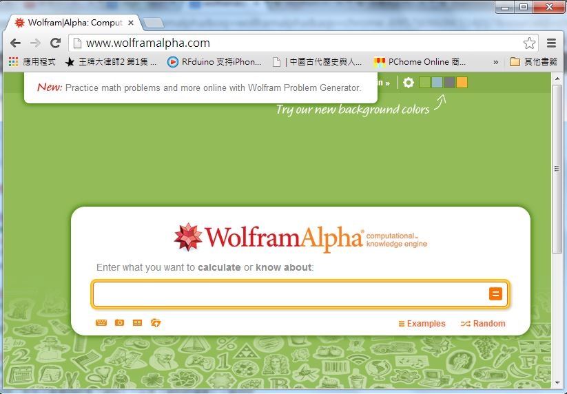
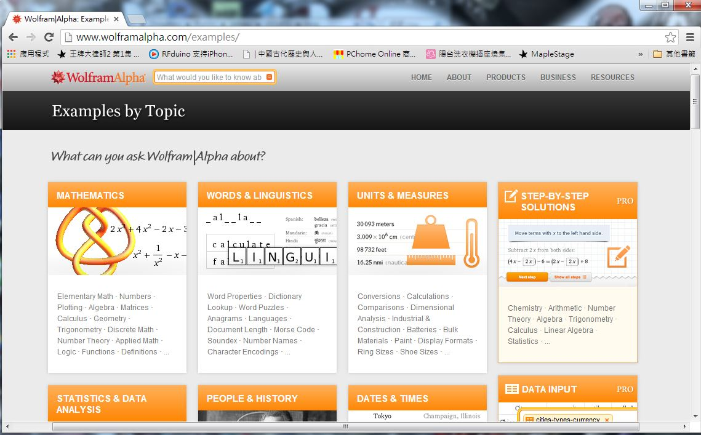
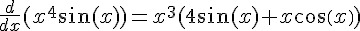
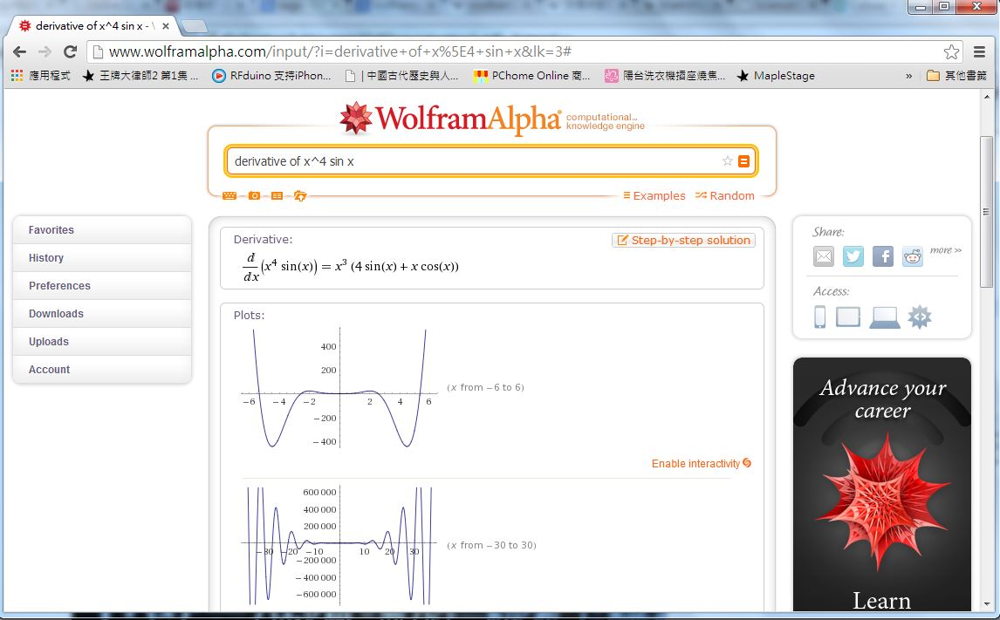
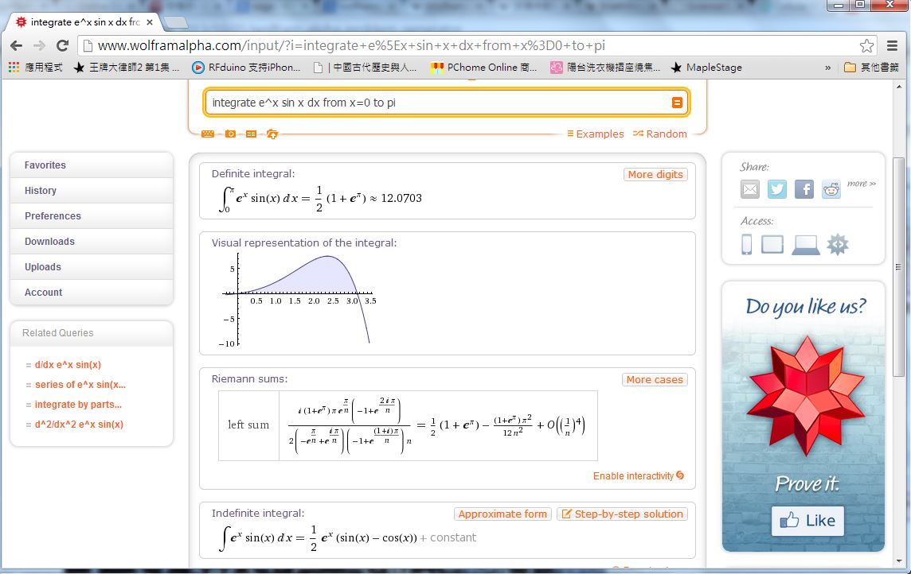
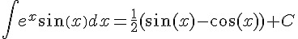
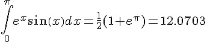
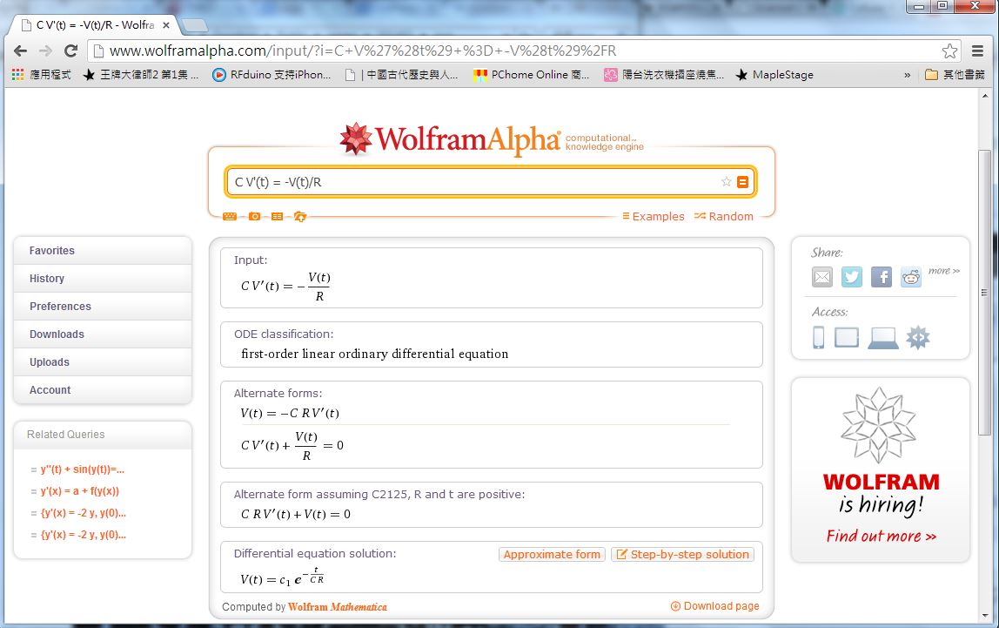
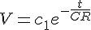

## 用電腦學數學 -- WolframAlpha 篇

### WolframAlpha 網站

<http://www.wolframalpha.com/> 是由 Wolfram Research, Inc. 這家公司所設計經營的一個網站，
或許很多人沒聽過這家公司，但如果說起該公司的產品 Mathematica 這個數學軟體，那應該就有很多
人聽過了。

Wolfram Research公司的總裁史蒂芬·沃爾夫勒姆於 2009年3月宣布了 Wolfram|Alpha 計劃，
該網站於 2009年5月15日正式上線。該網站曾在美國Popular Science雜誌的投票評選中獲得
2009年度最偉大的科技創新產品的榮譽。

一進入 WolframAlpha 這個網站，您可能會以為該網站是一個搜尋引擎，因為長得有點像 Google，
只不過界面更漂亮了一些。



如果您還沒用過該網站，請點選 Examples 連結，您會看到下列畫面。



仔細翻閱一下這個些範例，您會發現這個網站的神奇之處，他竟然可以解答
「數學、天文、地理、統計、化學、金融、物理、星象、工程、交通、電腦、....」等等問題。

既然 Wolfram 是 Mathematica 軟體的創造者，想必數學應該是他們的強項，就讓我們來用用看。

### 用 WolframAlpha 學數學

當您進入 <http://www.wolframalpha.com/examples/Math.html> 這個數學領域的範例網頁，
您會看到 WolframAlpha 可以解答的數學問題真的是五花八門，從基本的「加減乘除」到
「微分方程」都有。

WolframAlpha 可以「畫函數曲線圖、做符號微積分、數值微積分、求方程式的解」等等，
由於筆者正在教授微積分的課程，因此就讓我們先用 WolframAlpha 來學學微積分好了。

以下是微分指令「derivative of x^4 sin x」的顯示結果，除了顯示出   
的運算結果之外，還顯示了該函數的線圖，與泰勒展開式的前幾項等等，以下是顯示的畫面截圖。



會做微分並不算甚麼，積分行不行呢？答案當然是可以的，以下是筆者輸入的積分範例：

```
integrate e^x sin x dx from x=0 to pi
```

結果 WolframAlpha 回應了以下結果：



最下面顯示了不定積分的原型    。

而最上面則顯示了定積分的結果    。

以上結果是正確的！

### 解微分方程式

接著筆者輸入 `C V'(t) = -V(t)/R` 這個電容放電時的微分方程式，結果 WolframAlpha 回應畫面如下：



上圖中最下面的部份顯示了該微分方程的解答如下，這也是正確答案。

  

### 結語

看來、筆者似乎可以用這個網站來教「微積分、線性代數、機率統計、離散數學」等資訊工程領域的數學課，
應該是沒有問題的了！

補充：在本文預覽版分享出去之後，有朋友提到開放原始碼領域也有一個對應的網站，是用 Python 的 SymPi 建構而成的，
而且也可以安裝在自己的電腦上使用，該網站稱為 Mathics ，網址如下：

* <http://www.mathics.org/>

### 參考文獻

* 維基百科：[Wolfram Alpha](http://zh.wikipedia.org/wiki/Wolfram_Alpha)
* 維基百科：[沃爾夫勒姆研究公司](http://zh.wikipedia.org/wiki/Wolfram_Research)
* 維基百科：[MathWorld](http://zh.wikipedia.org/wiki/MathWorld)
* [出考題？知識引擎 Wolfram Alpha 幫你搞定！](http://www.inside.com.tw/2013/10/21/wolfram-alpha-problem-generator)

【本文由陳鍾誠取材並修改自 [維基百科]，採用創作共用的 [姓名標示、相同方式分享] 授權】

